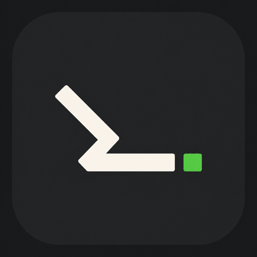

<div align="center">
  
  <h1>txtnimal</h1>
  <p>A minimal, keyboard-first todo.txt app for macOS.</p>
  <p>極簡、鍵盤優先的 macOS 純文字任務管理工具。</p>
</div>

<p align="center">
  <a href="#繁體中文">繁體中文</a> · <a href="#english">English</a>
</p>

---

# 繁體中文

txtnimal 是一款原生 macOS 任務管理工具。它將每項任務保存為普通文字的一行，讓你在享受圖形介面、鍵盤操作、Focus 與統計功能的同時，仍能完全掌握自己的資料。

## 特色

- **純文字優先**：任務保存於 `.txt` 文件，可用任何編輯器、搜尋工具或 Git 管理。
- **鍵盤工作流**：快速新增、移動、編輯、完成、搜尋與切換頁面。
- **時間清單**：依到期日分成 Today、Overdue、Upcoming、No date 與 Done。
- **List 與 Tag**：介面使用 List／Tag；底層仍保留 todo.txt 的 `+project`／`@context` 語法，維持相容性。
- **單一 Focus**：一次聚焦一項任務，並提供專注模式與置頂 HUD。
- **四象限**：以 `q:1`～`q:4` 手動安排任務，不替使用者猜測重要性。
- **便箋與統計**：內建純文字便箋、完成趨勢與活動統計。
- **自訂體驗**：支援中英文介面、深淺色、強調色、行距、中英文字體、文字大小及三款 App Icon。
- **本機運作**：不需帳號、雲端服務或遙測。

## 系統需求

- macOS 13 Ventura 或更新版本
- Apple Silicon 或 Intel Mac
- 從原始碼建置時需要 Xcode 與 Swift 5.9+

## 開始使用

### 使用 Xcode

1. 開啟 `TasksTxt.xcodeproj`。
2. 選擇 `TasksTxt` scheme 與 **My Mac**。
3. 按下 `⌘R` 建置並執行。

### 使用命令列

```bash
xcodebuild \
  -project TasksTxt.xcodeproj \
  -scheme TasksTxt \
  -configuration Debug \
  -derivedDataPath .build/DerivedData \
  build CODE_SIGNING_ALLOWED=NO

open .build/DerivedData/Build/Products/Debug/txtnimal.app
```

若修改了 `project.yml`，請先安裝 [XcodeGen](https://github.com/yonaskolb/XcodeGen) 並重新產生專案：

```bash
xcodegen generate
```

## 資料與檔案

預設資料夾為：

```text
~/Documents/tasks-txt/
├── tasks.txt    # 目前任務
├── scratch.txt  # 便箋
└── archive.txt  # 歷史完成項目
```

你可以在「設定 → 檔案」更換資料夾、開啟其他 `.txt` 文件，或釘選常用任務檔案。移至空資料夾時，txtnimal 會複製現有資料，原始文件會保留。

完成項目在完成當天仍會顯示；之後會移至 `archive.txt`。txtnimal 會盡可能保留未知 token、原始順序及未修改內容，降低 Git diff 中不必要的變動。

## 任務格式

最簡單的任務就是一行文字：

```text
Write release notes
```

也可以加入 txtnimal 與 todo.txt metadata：

```text
Review landing page due:2026-07-25 +website @mac note:"check mobile spacing"
```

| 語法 | 用途 |
|---|---|
| `x ` | 已完成任務的行首標記 |
| `+name` | List；底層相容 todo.txt Project |
| `@name` | Tag；底層相容 todo.txt Context |
| `due:YYYY-MM-DD` | 到期日 |
| `created:YYYY-MM-DD` | 建立日期 |
| `done:YYYY-MM-DD` | 完成日期 |
| `note:"..."` | 任務備註 |
| `q:1`～`q:4` | 四象限位置 |
| `focus:true` | 當前唯一 Focus 任務 |

快速輸入支援 `due:today`、`due:tomorrow`、`due:fri`、`due:3d` 與 ISO 日期，儲存時會正規化為 `YYYY-MM-DD`。

完整格式與 Project／Context 的原始語意請參閱 [todo.txt 格式規格](docs/todo-txt-format-spec.md)。

## 常用快捷鍵

| 快捷鍵 | 功能 |
|---|---|
| `⌘1`～`⌘5` | 清單／象限／便箋／統計／設定 |
| `↑` / `↓` | 移動游標 |
| `n` | 新增任務 |
| `Enter` / `e` | 行內編輯 |
| `⌘E` | 開啟完整編輯器 |
| `x` / `⌘Enter` | 完成或取消完成 |
| `f` / `⌘⇧F` | 切換 Focus |
| `z` | 進入或離開專注模式 |
| `/` / `⌘F` | 搜尋 |
| `p` | 加入 List |
| `R` | 將所有逾期任務改為今天 |
| `[` / `]` | 調整行距 |
| `⌘K` | 開啟指令面板 |
| `Esc` | 取消、清除篩選或返回清單 |

全域快速捕捉熱鍵可在設定頁自行綁定。

## 開發與測試

核心解析與檔案邏輯位於 Swift Package `TasksTxtCore`：

```bash
swift test
```

建置完整 macOS App：

```bash
xcodebuild \
  -project TasksTxt.xcodeproj \
  -scheme TasksTxt \
  -configuration Debug \
  build
```

主要目錄：

```text
App/                  SwiftUI App 與 macOS 整合
Sources/TasksTxtCore/ 純文字解析、工作區與檔案儲存
Tests/                核心單元測試
docs/                 格式與專案文件
project.yml           XcodeGen 專案定義
```

## 隱私與設計取捨

txtnimal 不建立帳號、不使用雲端後端，也不收集 telemetry。App 目前未啟用 macOS App Sandbox，以支援自訂檔案位置、全域快捷鍵、選單列常駐與開機啟動；因此目前定位為自行建置與作品展示版本，而非 Mac App Store 發行版本。

---

# English

txtnimal is a native macOS task manager that stores every task as a line of ordinary text. It combines a focused graphical interface with a fast keyboard workflow while keeping your data portable, readable, and under your control.

## Highlights

- **Plain text first:** Manage your tasks with any editor, search tool, or Git.
- **Keyboard-driven:** Quickly add, navigate, edit, complete, search, and switch views.
- **Time-based list:** Tasks are grouped into Today, Overdue, Upcoming, No date, and Done.
- **Lists and Tags:** The UI calls them List and Tag while preserving todo.txt's `+project` and `@context` syntax on disk.
- **Single Focus:** Keep one active task, with a focus mode and always-on-top HUD.
- **Four quadrants:** Assign tasks manually with `q:1` through `q:4`; the app does not guess their importance.
- **Scratchpad and statistics:** Keep quick notes and review completion activity.
- **Customizable:** Choose Chinese or English, appearance, accent color, spacing, separate Latin and Chinese fonts, text sizes, and one of three app icons.
- **Local by design:** No account, cloud backend, or telemetry.

## Requirements

- macOS 13 Ventura or later
- Apple Silicon or Intel Mac
- Xcode and Swift 5.9+ when building from source

## Getting started

### Xcode

1. Open `TasksTxt.xcodeproj`.
2. Select the `TasksTxt` scheme and **My Mac**.
3. Press `⌘R` to build and run.

### Command line

```bash
xcodebuild \
  -project TasksTxt.xcodeproj \
  -scheme TasksTxt \
  -configuration Debug \
  -derivedDataPath .build/DerivedData \
  build CODE_SIGNING_ALLOWED=NO

open .build/DerivedData/Build/Products/Debug/txtnimal.app
```

After changing `project.yml`, install [XcodeGen](https://github.com/yonaskolb/XcodeGen) and regenerate the project:

```bash
xcodegen generate
```

## Data and files

The default data directory is:

```text
~/Documents/tasks-txt/
├── tasks.txt    # Active tasks
├── scratch.txt  # Scratchpad
└── archive.txt  # Completed history
```

Use **Settings → Files** to change the directory, open another `.txt` document, or pin frequently used task files. When selecting an empty directory, txtnimal copies the current files and leaves the originals untouched.

Completed tasks remain visible on the day they are completed and move to `archive.txt` afterward. txtnimal preserves unknown tokens, original ordering, and untouched content whenever possible to avoid noisy Git diffs.

## Task format

A task can be as simple as one line:

```text
Write release notes
```

Add txtnimal and todo.txt metadata when needed:

```text
Review landing page due:2026-07-25 +website @mac note:"check mobile spacing"
```

| Syntax | Purpose |
|---|---|
| `x ` | Completed-task prefix |
| `+name` | List; compatible with todo.txt Project |
| `@name` | Tag; compatible with todo.txt Context |
| `due:YYYY-MM-DD` | Due date |
| `created:YYYY-MM-DD` | Creation date |
| `done:YYYY-MM-DD` | Completion date |
| `note:"..."` | Task note |
| `q:1`–`q:4` | Quadrant placement |
| `focus:true` | The single focused task |

Quick capture accepts `due:today`, `due:tomorrow`, `due:fri`, `due:3d`, and ISO dates, then normalizes them to `YYYY-MM-DD` on disk.

See the [todo.txt format specification](docs/todo-txt-format-spec.md) for the full syntax and the original meaning of Project and Context.

## Keyboard shortcuts

| Shortcut | Action |
|---|---|
| `⌘1`–`⌘5` | List / Quadrants / Scratchpad / Statistics / Settings |
| `↑` / `↓` | Move the cursor |
| `n` | Add a task |
| `Enter` / `e` | Edit inline |
| `⌘E` | Open the full editor |
| `x` / `⌘Enter` | Complete or uncomplete |
| `f` / `⌘⇧F` | Toggle Focus |
| `z` | Enter or leave focus mode |
| `/` / `⌘F` | Search |
| `p` | Add a List |
| `R` | Reschedule every overdue task to today |
| `[` / `]` | Adjust row spacing |
| `⌘K` | Open the command palette |
| `Esc` | Cancel, clear a filter, or return to the list |

The global quick-capture shortcut can be changed in Settings.

## Development and testing

The parser and file-management logic live in the `TasksTxtCore` Swift package:

```bash
swift test
```

Build the complete macOS app with:

```bash
xcodebuild \
  -project TasksTxt.xcodeproj \
  -scheme TasksTxt \
  -configuration Debug \
  build
```

Repository layout:

```text
App/                  SwiftUI app and macOS integrations
Sources/TasksTxtCore/ Plain-text parsing, workspace, and file storage
Tests/                Core unit tests
docs/                 Format and project documentation
project.yml           XcodeGen project definition
```

## Privacy and trade-offs

txtnimal has no accounts, cloud backend, or telemetry. The macOS App Sandbox is currently disabled to support custom file locations, a global shortcut, menu-bar presence, and launch at login. This build is intended for local use and portfolio distribution rather than the Mac App Store.
