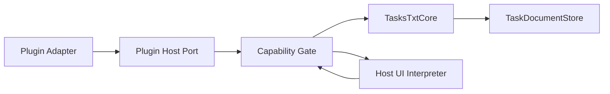

# Architecture Spine — txtnimal Two-Layer Plugin System

## Design Paradigm

Hexagonal host with declarative UI interpreter: plugin packages and runners are adapters; the versioned Plugin Host API is the port; `TasksTxtCore` owns domain mutation; the host renderer interprets validated page documents into host-owned SwiftUI views.



## Invariants & Rules

### AD-1 — One host contract for both layers

- **Binds:** command plugins, controlled-page plugins
- **Prevents:** page plugins gaining a second, weaker data or mutation path
- **Rule:** Both layers use the same manifest identity, capability gate, snapshot envelope, command handler, runner lifecycle, compatibility policy, limits, and audit envelope.

### AD-2 — Domain mutation is host-owned

- **Binds:** all task and scratch mutations
- **Prevents:** plugins bypassing todo.txt validation or overwriting external edits
- **Rule:** Plugins emit versioned command intents; only `TasksTxtCore` applies them after capability, payload, task-ID, and file-revision validation. Plugins receive no store or file URL.

### AD-3 — Plugin UI is data, never executable native UI

- **Binds:** controlled-page plugins
- **Prevents:** Swift ABI coupling, arbitrary view injection, host-state access, and UI crashes in the main process
- **Rule:** A plugin returns a versioned declarative page document containing only allowlisted nodes, properties, queries, and actions. The host alone creates SwiftUI views.

### AD-4 — Built-in surfaces are not extension points

- **Binds:** navigation and all built-in views
- **Prevents:** plugins hiding management UI, conflicting over injection slots, or breaking built-in shortcuts
- **Rule:** Plugins may add destinations through the Plugins Hub and user-controlled pinning; they cannot replace, wrap, reorder, or inject into built-in views.

### AD-5 — Fail closed

- **Binds:** manifests, capabilities, events, page schema, actions, compatibility
- **Prevents:** newer or malicious plugins obtaining unintended fallback behavior
- **Rule:** Unknown IDs, capabilities, events, nodes, properties, actions, and incompatible major versions reject the affected plugin or page; they are never silently ignored.

### AD-6 — Queries are bounded and redacted

- **Binds:** task reads and page data sources
- **Prevents:** accidental full-vault disclosure and unbounded UI payloads
- **Rule:** The host executes declared queries with field, count, payload, and permission limits. Full-task access is a separately confirmed capability; page documents cannot embed persistent private snapshots.

### AD-7 — Actions re-enter the same gate

- **Binds:** buttons, forms, task rows, plugin commands, events
- **Prevents:** renderer bindings directly mutating `TaskStore`
- **Rule:** Every user or event action becomes a typed HostAction or PluginAction and returns through the capability gate before any read, mutation, file operation, notification, or storage access.

### AD-8 — Public plugins run outside the host process

- **Binds:** public third-party distribution
- **Prevents:** plugin crashes, infinite loops, memory pressure, or shared process state terminating or contaminating the App
- **Rule:** Public plugins execute in identity-isolated, resource-limited workers behind a signed XPC broker. XPC is not treated as a sandbox; worker entitlements and allowlists are explicit.

### AD-9 — Package identity is content-bound

- **Binds:** installation, updates, permissions, revocation
- **Prevents:** path escape, ID shadowing, and retained grants after code changes
- **Rule:** Canonical entry paths stay inside the package; IDs are unique; enabled package content is immutable; grants bind to plugin ID, signer/source, manifest, entry hash, API major, and capability set.

### AD-10 — Compatibility is versioned at both boundaries

- **Binds:** Plugin Host API and page schema
- **Prevents:** an App update interpreting old executable behavior or UI documents differently
- **Rule:** API and schema have independent integer major versions and additive minor features. Incompatible majors reject; deprecations receive a warning window before removal.

## Consistency Conventions

| Concern | Convention |
|---|---|
| Identity | reverse-DNS plugin ID; plugin-scoped command/page/node IDs |
| Data | Codable value envelopes; ISO dates; stable task IDs; explicit revision |
| Actions | `HostAction` or `PluginAction`; no closures or selectors across the boundary |
| Errors | stable error code＋localized Host message＋redacted diagnostic detail |
| UI | semantic style tokens only; Host owns theme, fonts, accessibility, focus and localization |
| State | transient page state in Host; bounded plugin KV only with capability |
| Events | post-commit, at-least-once, event ID, origin, depth and queue limits |

## Stack

| Name | Version |
|---|---|
| macOS deployment target | 13.0 |
| Swift language mode | 5.0 |
| Apple Swift compiler | 6.3.2 |
| Xcode | 26.5 (17F42) |
| SwiftUI | macOS 13 system framework |
| JavaScriptCore | macOS 13 system framework |
| Foundation XPC | macOS 13 system framework |

## Structural Seed

```text
Sources/TasksTxtCore/
  PluginContracts/       # stable IDs, snapshots, commands, revisions
App/Plugins/
  Registry/              # discovery, manifest, grants, compatibility
  Runtime/               # runner client, limits, lifecycle
  Renderer/              # schema decoder, validation, SwiftUI nodes
  Navigation/            # Plugins Hub and host-owned destinations
PluginRunner/
  Broker/                # signed XPC boundary
  Worker/                # identity-isolated JavaScriptCore execution
```

## Deferred

- Exact worker topology: decide after the mandatory XPC／Sandbox spike.
- Public trust root, catalog, notarization, update and revocation service: required before public distribution, not for trusted local MVP.
- Arbitrary network access: excluded from V1; reconsider only with domain-level grants and a concrete plugin case.
- Additional renderer nodes: add only after two real plugins cannot express a required page with V1 nodes.
- Plugin modification of built-in screens and native SwiftUI plugins: intentionally excluded, not deferred.
